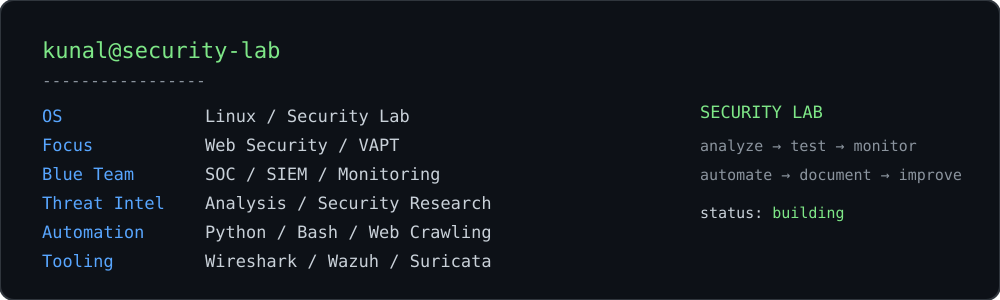
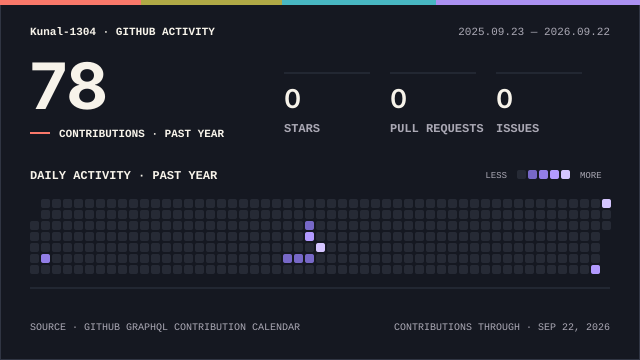

 

 

 <b><i>Interested in cybersecurity, security research, and building practical security tools.</i></b>

---

## 👨‍💻 About Me

I'm a B.Tech Computer Science student specializing in Cybersecurity, with hands-on experience across **web security, VAPT, security monitoring, threat intelligence, and security automation**.

Through academic projects and internships, I've worked with **SIEM and SOC tools, network monitoring, malware-analysis environments, and security-analysis tools**. I'm particularly interested in understanding how attacks work, identifying vulnerabilities, and building tools that automate security workflows.

Currently, I'm focusing on strengthening my skills in **web application security, VAPT, Python/Bash automation, security tooling, and practical security research**.

> 🔎 **Security interests:** Web Security • VAPT • SOC • Threat Intelligence • Security Automation

---

## 🛠️ Technical Skills

### 🔐 Security & VAPT
`Web Security` `VAPT` `OWASP` `Vulnerability Assessment` `Security Testing`

### 🛡️ SOC & Security Monitoring
`SIEM` `Wazuh` `Splunk` `Suricata` `Zabbix` `PRTG` `Network Monitoring`

### 🕵️ Threat Intelligence & Malware Analysis
`Threat Intelligence` `YARA` `CAPE / Cuckoo Sandbox` `Malware Analysis`

### ⚙️ Security Tools
`Wireshark` `Nikto` `SEToolkit` `Autopsy` `FTK Imager` `Pro-Discover`

### 💻 Programming & Automation
`Python` `Bash` `Web Crawling` `Security Automation`

### 🌐 Web & Networking
`HTML` `CSS` `Networking` `TCP/IP` `Web Technologies`

---

## 🚀 Featured Projects

### 🛡️ Threat Intelligence Dashboard

An interactive cybersecurity dashboard for monitoring and analyzing simulated threat intelligence data.

- 📊 Visualizes threat types, geographic distribution, and historical trends
- 🔎 Supports filtering by threat type, country, and time range
- ⚠️ Performs confidence-based risk assessment and anomaly identification
- 🔔 Includes real-time notifications and WhatsApp alert integration
- 🧩 Designed with a modular architecture for future threat-intelligence API integrations

**Tech:** `React` `TailwindCSS` `JavaScript` `Recharts` `Lucide React`

🔗 [View Project](https://github.com/Kunal-1304/threat_intelligence_program)

---

## 💼 Experience

### 🛡️ VAPT Intern — CYART
**6 months - Feb to august 2026**

- Worked on practical web application security and VAPT activities
- Documented weekly security-testing work and findings throughout the internship
- Maintained structured internship reports covering the work performed

📂 [Internship Documentation](https://github.com/Kunal-1304/cyart-vapt-team)

### 🔐 Cybersecurity Intern — Cyber Secured India
**Jun 2025 – Aug 2025**

- Researched, installed, and configured security monitoring tools including `Wazuh`, `Suricata`, and `MISP`
- Worked with NOC and network-monitoring tools including `PRTG` and `Zabbix`
- Explored SOC workflows, security monitoring, alerting, and network visibility

### 📊 Security Intern — Placify Technologies
**Jun 2024 – Aug 2024**

- Monitored security logs and analyzed attack activity using `Splunk` and SIEM tools
- Gained practical exposure to security monitoring and log analysis

### 💻 Cybersecurity Intern — Cybervidyapeeth Foundation
**Jun 2023 – Aug 2023**

- Worked with basic PowerShell installation and setup
- Gained foundational exposure to cybersecurity tooling and environments

---

## 🎓 Certifications & Training

- 🔐 **Pre-Security** — TryHackMe
- 🐍 **Python Essentials 1 & 2** — Cisco Networking Academy
- 🌐 **JavaScript Essentials 1 & 2** — Cisco Networking Academy
- 🗄️ **SQL, DSA, C++, Java Bootcamp** — Let's Upgrade
- 💼 **Career Edge – Young Professional** — TCS iON
- 🛡️ **Cybersecurity Internship** — Cyber Secured India
- 📊 **Security Internship** — Placify Technologies
- 🔒 **Cybersecurity Internship** — Cybervidyapeeth Foundation

---

## 🎯 Current Focus

I'm currently focused on building practical cybersecurity skills through hands-on projects, security research, and automation.

- 🔐 Web Application Security & VAPT
- ⚙️ Python & Bash Security Automation
- 🕷️ Web Crawling & Security Data Extraction
- 🛡️ SOC, SIEM & Security Monitoring
- 🧠 Threat Intelligence & Security Analysis
- 🦠 Malware Analysis & Sandbox Environments
- 🐧 Linux & Security Tooling

> 🚧 Currently rebuilding and improving my security projects with a focus on practical implementation, documentation, and automation.

## 📊 GitHub Activity

  <picture>
    <source
      media="(prefers-color-scheme: dark)"
      srcset="./profile/github-activity-dark.svg"
    />
    <source
      media="(prefers-color-scheme: light)"
      srcset="./profile/github-activity-light.svg"
    />
    
  </picture>

---

## 🤝 Let's Connect

  
  
  

---

## 🐍 Contribution Activity

  <picture>
    <source
      media="(prefers-color-scheme: dark)"
      srcset="https://raw.githubusercontent.com/Kunal-1304/Kunal-1304/output/github-snake-dark.svg"
    />
    <source
      media="(prefers-color-scheme: light)"
      srcset="https://raw.githubusercontent.com/Kunal-1304/Kunal-1304/output/github-snake.svg"
    />
    
  </picture>

